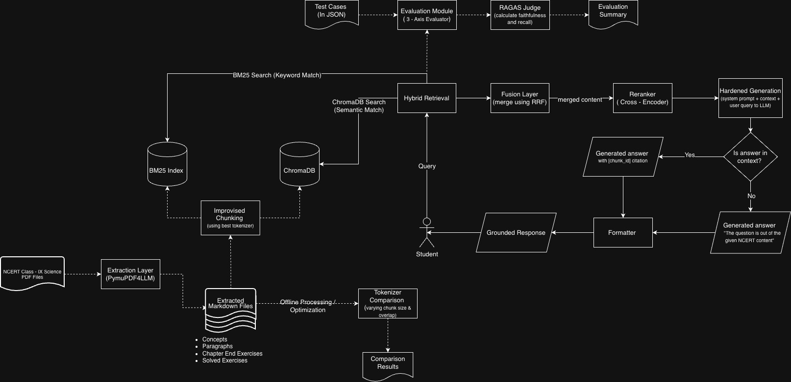

# PariShiksha NCERT Science QA Retrieval System


## Problem Statement

PariShiksha is an ed-tech non-profit rolling out AI-powered tutoring centres in Tier-2 and Tier-3 Indian cities. Students in these centres need a study assistant that can answer questions from the NCERT (Class 9 Science) textbooks accurately and reliably. The assistant must:

- **Answer only from the textbook** — hallucinated or fabricated answers erode tutor and parent trust
- **Refuse gracefully** when asked questions outside the NCERT syllabus
- **Handle messy real-world input** — PDF extraction artifacts, code-switched queries, paraphrased questions

This project builds a Retrieval-Augmented Generation (RAG) pipeline that extracts, chunks, and indexes NCERT Science content, retrieves relevant passages using BM25/FAISS, and generates grounded answers using LLMs (Gemini 2.5 Flash / Llama 3.1 via Groq) with strict grounding prompts. The system is evaluated on 20 questions across 3 categories (direct, paraphrased, out-of-scope) using a 3-axis scoring framework (correctness, groundedness, refusal appropriateness).

[Requirement Doc](https://drive.google.com/file/d/1BIkDE5TjjngiTJky9iHsAwuT9W4HQ6qV/view?usp=sharing)

## Environment Setup

The project uses Python 3.10+.

1. Set up the virtual environment:

```bash
python -m venv .venv
source .venv/bin/activate
```

2. Install dependencies:

```bash
pip install pymupdf pdfplumber transformers tokenizers torch rank_bm25 google-genai groq sentence-transformers
```

or

```bash
pip install -r requirements.txt
```

3. Ensure you have a `.env` file with your Gemini free-tier and Groq API keys:

```bash
cp .env.example .env
```

```env
API_KEY=your_gemini_api_key
GROQ_API_KEY=your_groq_api_key
OCR_SPACE_API_KEY=your_ocr_space_api_key
```

## Data Source

NCERT science textbook source:
[https://ncert.nic.in/textbook.php?iesc1=0-11](https://ncert.nic.in/textbook.php?iesc1=0-11)

Download Chapter files as: `iesc1XX.pdf` (e.g., `iesc102.pdf` = Chapter 2: Motion) and place them in the `iesc1dd/` directory in the root.

## How to Extract PDF Content

### 1. Extraction using pymupdf4llm (Recommended)

To extract text using `pymupdf4llm` (which preserves formulas and equations) and automatically split them:

```bash
python src/scripts/extract.py
```

### 2. OCR Extraction

Extracting PDF using OCR Space API (image-based OCR):

```bash
python src/scripts/old_extract.py
```

### 3. Splitting the text files into sections (Optional)

If you already have text files and only need to re-run the splitting logic:

```bash
python src/scripts/split_sections.py
```

## Chunking Strategy

Chunking is the process of splitting the text into smaller chunks that can be processed by the LLM.

The system uses a hybrid chunking strategy based on semantic classification and token-length optimization. Detailed justification can be found in [chunking_strategy.md](docs/chunking_strategy.md).

## Data Organization

Extracted content is categorized into concepts, worked examples, exercises, and sanitized paragraphs.

Detailed information on how this structure improves RAG performance can be found in [data_organization.md](docs/data_organization.md).

## Running the Retrieval System

### 1. Vector Database & Retrieval Demo

To run the primary retrieval demo which tests semantic (FAISS) and keyword (BM25) search:

```bash
cd src
python retrieval_demo.py
```

### 2. Tokenizer & Chunking Evaluation

To evaluate different tokenizers and chunking configurations:

```bash
cd src
python tokenizer_evaluation.py
```

Results and comparison tables will be saved in the `data/` directory.

### 3. End-to-End Pipeline

To run the entire pipeline (extraction, evaluation, and retrieval) in one go:

```bash
python main_pipeline.py
```

## Grounded Generation

The system supports two backends for grounded generation. Both use strict grounding prompts to ensure answers are based only on NCERT context.

### 1. Gemini Implementation

Standard implementation using the Gemini 2.5 Flash model.

```bash
python src/grounded_generation.py         # Standard Test
python src/grounded_generation.py --full  # Full Corpus Test
```

### 2. Groq Implementation (Recommended)

High-speed implementation using Llama-3-8B via Groq.

```bash
python src/groq_generation.py         # Standard Test
python src/groq_generation.py --full  # Full Corpus Test
```

### 3. Interactive Q&A Mode

To start a live interactive session with the assistant:

```bash
python src/groq_generation.py --interactive
```

## Evaluation

Run the full 3-axis evaluation (correctness, groundedness, refusal) against 20 questions:

```bash
python src/evaluate.py
```

Or via the main pipeline:

```bash
python main_pipeline.py --evaluate
```

This generates:

- `data/evaluation_results.csv` — Raw scores for each question
- [evaluation_results.md](docs/evaluation_results.md) — Summary report with working/failing example analysis

## High-Level Design



The system follows a 4-stage RAG pipeline. PDFs are extracted and chunked using BERT tokenization, indexed with BM25 and FAISS, and queried through a grounding prompt that forces the LLM to either answer from context or refuse.

| Layer      | Technology     | Purpose                                 |
| ---------- | -------------- | --------------------------------------- |
| Extraction | pymupdf4llm    | PDF → structured markdown              |
| Chunking   | BERT WordPiece | 400-token chunks, 50-token overlap      |
| Retrieval  | BM25 + FAISS   | Keyword + semantic search               |
| Generation | Groq / Gemini  | Grounded answer with refusal capability |
| Storage    | Pickle + FAISS | Persistent indexes on disk              |

## Project Documentation

| Document                                         | Description                                        |
| ------------------------------------------------ | -------------------------------------------------- |
| [notebook.ipynb](notebook.ipynb)                    | End-to-end pipeline demonstration (Stages 1–4)    |
| [evaluation_results.md](docs/evaluation_results.md) | 20-question evaluation with 3-axis scoring         |
| [reflection.md](docs/reflection.md)                 | Project Reflection (Parts A–E, 13 questions)      |
| [failure_modes.md](docs/failure_modes.md)           | Top 3 production failure modes analysis            |
| [chunking_strategy.md](docs/chunking_strategy.md)   | Chunking size, overlap, and strategy justification |
| [data_organization.md](docs/data_organization.md)   | Content classification and data structure          |

## Diagnostic Tools

A dedicated retrieval test script is available in the tests directory:

```bash
python tests/test_retrieval.py
```

## Contributors 

* [Bryson Gracias](https://github.com/MrGladiator14)
* [Niranjan Hebli](https://github.com/NiranjanHebli)
